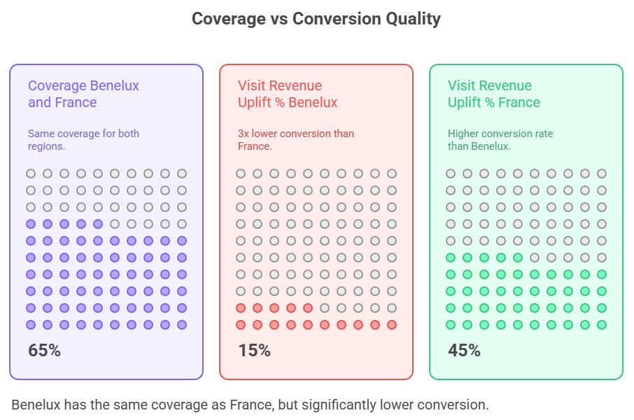
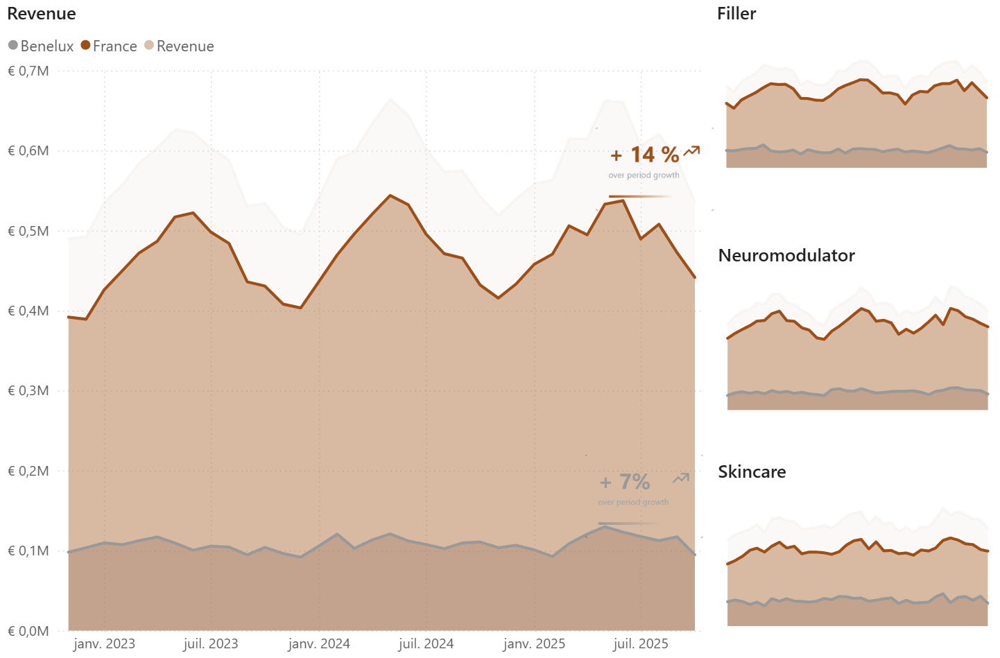
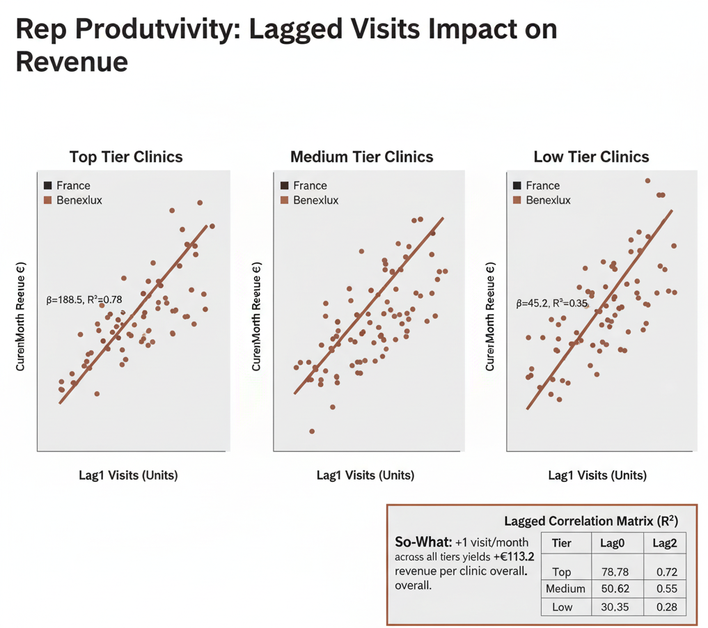
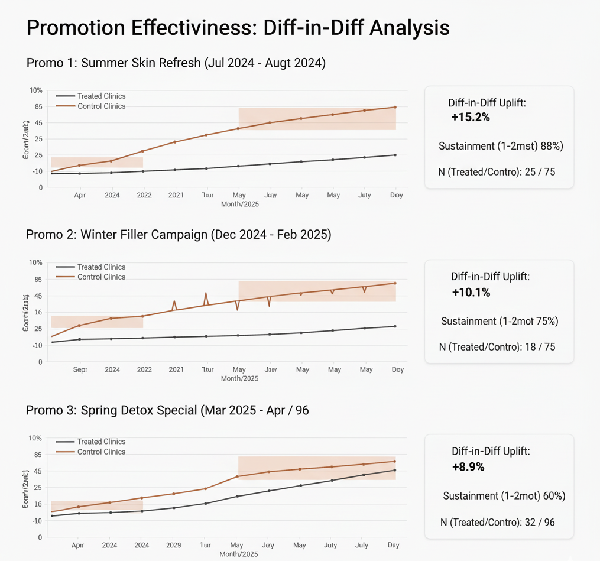
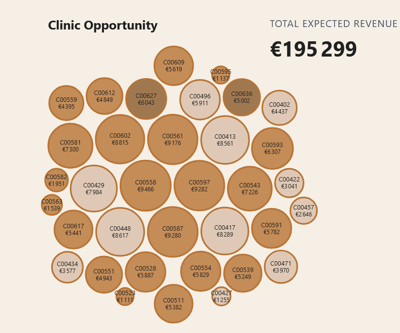
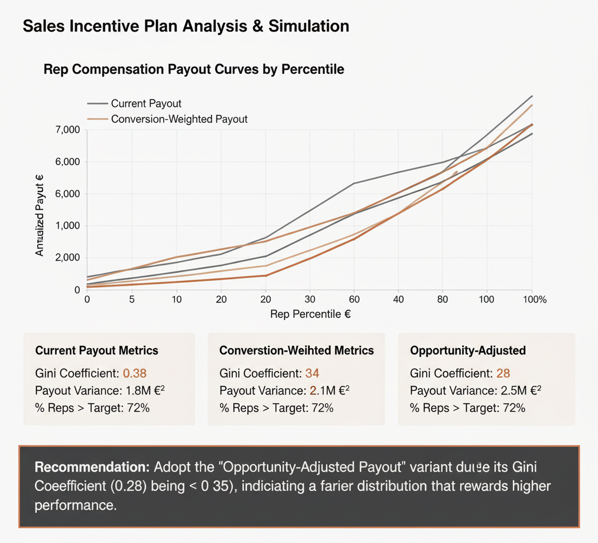

# Sample Aesthetics — France vs Benelux Commercial Performance

**Identifying €148K+ annual revenue opportunity through targeting optimization**

*Visual design inspired by Allergan Aesthetics brand guidelines*

---

## Client Background

**Sample Aesthetics** operates across France and Benelux (Belgium, Netherlands, Luxembourg) with a focused portfolio of facial injectables, dermal fillers, and skincare products.  
Over 36 months (Nov 2022–Oct 2025), the company generated €20.8M through 641 clinics served by 51 sales representatives. Despite similar coverage rates, France outperforms Benelux by 4.3x in absolute revenue—revealing a targeting quality issue, not an effort problem.

### North Star Metrics
- **Coverage & Frequency**: Visits per clinic and call plan compliance  
- **Conversion Quality**: Revenue per rep visit (€1,186 France vs €467 Benelux)  
- **Market Share**: Units sold vs estimated competitor activity  
- **Rep Productivity**: Visit-to-revenue correlation (lagged)  
- **Territory Opportunity**: Clinic potential score vs realized revenue  

---

## Executive Summary

### The Bottom Line

France generates €16.9M (4.3x Benelux) with accelerating momentum (+14% H1→H2 growth), while Benelux plateaus at €3.9M (+7.2% growth).  
**The root cause isn't market size—it's targeting precision.** Benelux has 67% coverage (similar to France's 65%), but visits convert at 2.5x lower rates.  
Fix targeting, and we unlock €148K+ annually with zero new headcount.

  

---

## 1. Revenue Trajectory with Regulatory Impact

  

---

## 2. Coverage vs Opportunity: The Targeting Quality Gap

  

---

## 3. Rep Productivity: Visit-to-Revenue Correlation

  

---

## 4. Promotion Event Study: Diff-in-Diff Analysis

  

---

## 5. Territory Opportunity Mapping & Pilot Design

  

---

## 6. Sales Incentive Plan Simulation

  

---

## Visual Styling Guide (for Webapp)

**Color Palette**  
- **Copper accent:** `#B87333` → key highlights, KPIs  
- **Pale Peach:** `#F5EFE6` → card backgrounds  
- **Light Tan:** `#DABFAA` → borders, accents  
- **Dark Charcoal:** `#212121` → text, labels  
- **White:** `#FFFFFF` → clean background  

**Typography**  
- **Font:** Helvetica Neue / system sans-serif  
- **Titles:** 24–28 px bold  
- **Subheads:** 18–20 px medium  
- **Body text:** 12–14 px regular  
- **Chart labels:** 10–12 px  

**Chart Rules**  
- Use a variety: line, scatter, heatmap, Sankey, event study, and payout curves  
- Copper = hero color  
- Minimize non-data ink; keep legends and axes clear  
- Ensure accessibility and contrast  

---

## Methodology & Caveats

This analysis uses **synthetic but realistic data** seeded with public anchors (ISAPS, DREES, clinic registries).  
All observed patterns mimic plausible commercial performance but do **not** represent real company data.

**Key analytical methods**  
- Growth rates: H1 vs H2 comparisons  
- Lagged regression (visit → revenue +1 month)  
- Diff-in-diff for promo impact  
- Opportunity scoring (30% potential, 50% revenue, 20% growth)  
- Gini fairness metric for incentive models  

**Caveats**  
Correlation ≠ causation.  
Event studies and pilots estimate incremental impact but retain uncertainty.  
Always validate pilots with control groups or A/B tests.

---

## Next Steps

**Next 30 Days**
- ✅ Present insights to Sales Leadership  
- ✅ Launch Benelux pilot (35 clinics, €148K target)  
- ✅ Validate re-tiering model  
- ✅ Assign pilot reps (4 Netherlands reps)  

**Q1 2026**
- Run pilot with weekly KPI dashboard  
- Start rep coaching (French best practices)  
- Prepare promotional calendar for full 2026  
- Draft SIP Variant C (opportunity-adjusted)

**Q2 2026**
- Review pilot results (+€37K quarterly incremental)  
- Scale or pivot based on data  
- Deploy SIP Variant C for H2 2026 pilot  

---

**Built by an analyst who finds money, not just dashboards** 💊  

**€148K+ Annual Opportunity | Zero New Headcount | Data-Driven Targeting**

